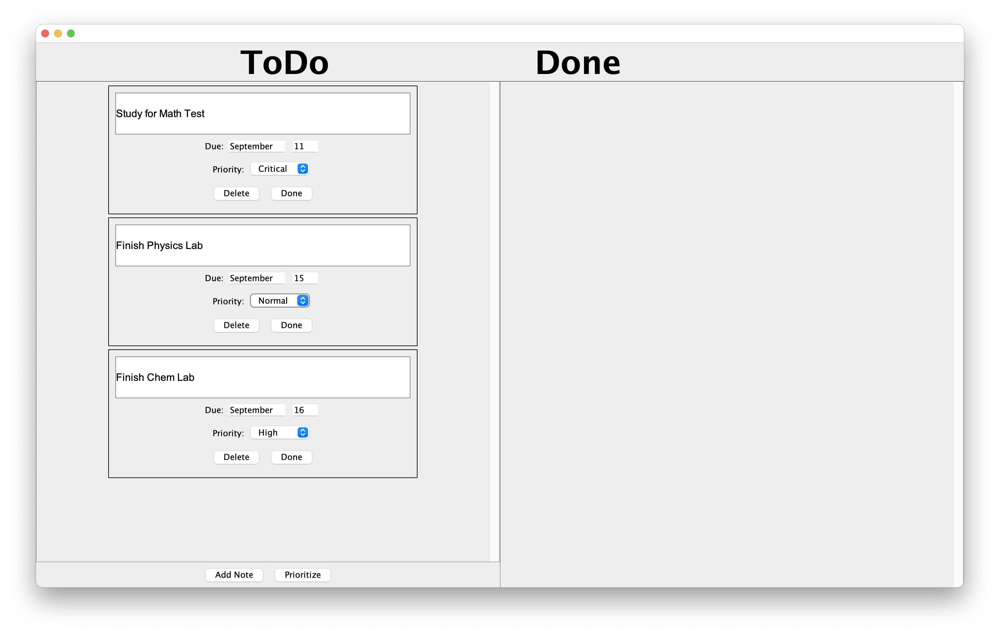

A to-do tracker that helps organize tasks that need to be completed.

The to-do tracker uses Java Swing to create a GUI. Each task can have a description, a due date, and a priority level. Additionally, there is a prioritization feature that sorts tasks based on their importance and how close they are to the due date.

